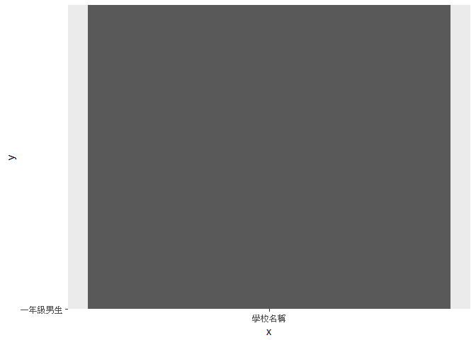
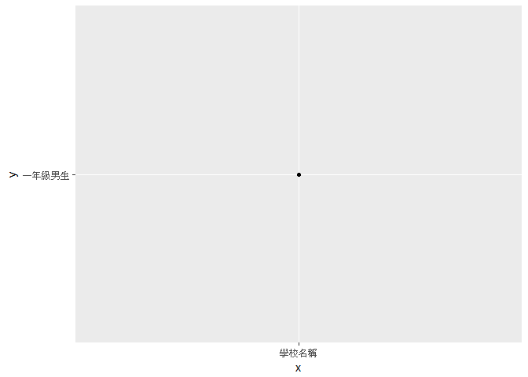
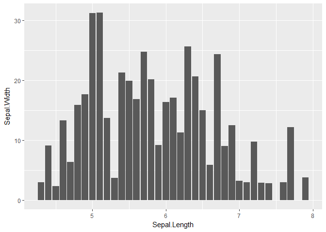

長庚大學 大數據分析方法 作業六
================

組員
----

閻俞蓉

分析議題背景
------------

台灣有非常多所大學，需要透過考試或推甄進入就讀。國立大學和私立大學的學生數和老師數一定不同，各個科系的學生人數也不同。

分析動機
--------

身為私立大學的學生，想要分析研究長庚大學與其他國立大學的學生人數有何差異，也探討各個科系的男女生比例和師生比。

使用資料
--------

資料來源:政府資料開放平台 資料類型：CSV 主要欄位:學校代碼、學校名稱、日間∕進修別、等級別、總計、男生計、女生計、一年級男生、一年級女生、二年級男生、二年級女生、三年級男生、三年級女生、四年級男生、四年級女生、五年級男生、五年級女生、六年級男生、六年級女生、七年級男生、七年級女生、延修生男生、延修生女生、縣市名稱、體系別

1.大專院校校別學生數 2.大專院校校別專任教師數 3.大專院校各校科系別學生數 4.大專院校各科系所學生數

``` r
library(readr)
```

    ## Warning: package 'readr' was built under R version 3.3.3

``` r
# 大專院校校別學生數
X105_student <- read_csv("C:/Users/user/Desktop/105_student.csv")
```

    ## Parsed with column specification:
    ## cols(
    ##   .default = col_integer(),
    ##   學校代碼 = col_character(),
    ##   學校名稱 = col_character(),
    ##   `日間∕進修別` = col_character(),
    ##   等級別 = col_character(),
    ##   縣市名稱 = col_character(),
    ##   體系別 = col_character()
    ## )

    ## See spec(...) for full column specifications.

``` r
knitr::kable(head(X105_student))
```

| 學校代碼 | 學校名稱     | 日間∕進修別 | 等級別 | 一年級男生 | 一年級女生 | 二年級男生 | 二年級女生 | 三年級男生 | 三年級女生 | 四年級男生 | 四年級女生 | 五年級男生 | 五年級女生 | 六年級男生 | 六年級女生 | 七年級男生 | 七年級女生 | 延修生男生 | 延修生女生 | 縣市名稱  | 體系別 |
|:---------|:-------------|:------------|:-------|:----------:|:----------:|:----------:|:----------:|:----------:|:----------:|:----------:|:----------:|:----------:|:----------:|:----------:|:----------:|:----------:|:----------:|:----------:|:----------:|:----------|:-------|
| 0001     | 國立政治大學 | D 日        | D 博士 |     113    |     66     |     91     |     68     |     90     |     63     |     77     |     58     |     86     |     48     |     84     |     40     |     64     |     33     |      0     |      0     | 30 臺北市 | 1 一般 |
| 0001     | 國立政治大學 | D 日        | M 碩士 |     617    |     755    |     622    |     712    |     352    |     422    |     217    |     265    |      0     |      0     |      0     |      0     |      0     |      0     |      0     |      0     | 30 臺北市 | 1 一般 |
| 0001     | 國立政治大學 | D 日        | B 學士 |     872    |    1347    |    1017    |    1232    |     850    |    1367    |     846    |    1398    |      0     |      0     |      0     |      0     |      0     |      0     |     327    |     455    | 30 臺北市 | 1 一般 |
| 0001     | 國立政治大學 | N 職        | M 碩士 |     281    |     297    |     261    |     265    |     193    |     160    |     92     |     84     |     55     |     30     |      0     |      0     |      0     |      0     |      0     |      0     | 30 臺北市 | 1 一般 |
| 0002     | 國立清華大學 | D 日        | D 博士 |     235    |     83     |     205    |     59     |     211    |     55     |     167    |     41     |     148    |     46     |     125    |     43     |     173    |     54     |      0     |      0     | 18 新竹市 | 1 一般 |
| 0002     | 國立清華大學 | D 日        | M 碩士 |    1206    |     492    |    1056    |     484    |     378    |     188    |     122    |     101    |      0     |      1     |      0     |      0     |      0     |      0     |      0     |      0     | 18 新竹市 | 1 一般 |

``` r
# 大專院校校別專任教師數
X105_teacher <- read_csv("C:/Users/user/Desktop/105_teacher.csv")
```

    ## Parsed with column specification:
    ## cols(
    ##   .default = col_integer(),
    ##   學校代碼 = col_character(),
    ##   學校名稱 = col_character(),
    ##   `日間∕進修別` = col_character(),
    ##   縣市名稱 = col_character(),
    ##   體系別 = col_character()
    ## )
    ## See spec(...) for full column specifications.

``` r
knitr::kable(head(X105_teacher))
```

| 學校代碼 | 學校名稱         | 日間∕進修別 | 教授男 | 教授女 | 副教授男 | 副教授女 | 助理教授男 | 助理教授女 | 講師男 | 講師女 | 專業技術人員及教師男 | 專業技術人員及教師女 | 專案教學人員男 | 專案教學人員女 | 教官、護理教師及護理實習臨床指導男 | 教官、護理教師及護理實習臨床指導女 | 助教男 | 助教女 | 縣市名稱  | 體系別 |
|:---------|:-----------------|:------------|:------:|:------:|:--------:|:--------:|:----------:|:----------:|:------:|:------:|:--------------------:|:--------------------:|:--------------:|:--------------:|:----------------------------------:|:----------------------------------:|:------:|:------:|:----------|:-------|
| 0001     | 國立政治大學     | 日          |   197  |   107  |    132   |    93    |     74     |     47     |    4   |    7   |           4          |           4          |       16       |       14       |                  0                 |                  5                 |    2   |   21   | 30 臺北市 | 1 一般 |
| 0001     | 國立政治大學     | 修          |    3   |    0   |     1    |     0    |      0     |      0     |    0   |    0   |           0          |           0          |        0       |        0       |                  0                 |                  0                 |    0   |    0   | 30 臺北市 | 1 一般 |
| 0002     | 國立清華大學     | 日          |   301  |   53   |    114   |    64    |     53     |     25     |    2   |    2   |           1          |           1          |       15       |       12       |                  7                 |                  2                 |    0   |    0   | 18 新竹市 | 1 一般 |
| 0002     | 國立清華大學     | 修          |    3   |    0   |     0    |     0    |      0     |      0     |    0   |    0   |           0          |           0          |        0       |        0       |                  0                 |                  0                 |    0   |    0   | 18 新竹市 | 1 一般 |
| 0003     | 國立臺灣大學     | 日          |   889  |   260  |    320   |    155   |     200    |     144    |   17   |   11   |           2          |           2          |       22       |       16       |                  1                 |                  2                 |    3   |   12   | 30 臺北市 | 1 一般 |
| 0004     | 國立臺灣師範大學 | 日          |   264  |   143  |    118   |    125   |     51     |     44     |    7   |    9   |           4          |           1          |       20       |       17       |                  0                 |                  1                 |    2   |   12   | 30 臺北市 | 3 師範 |

``` r
# 大專院校各校科系別學生數
X105_students <- read_csv("C:/Users/user/Desktop/105_students.csv")
```

    ## Parsed with column specification:
    ## cols(
    ##   .default = col_integer(),
    ##   學校代碼 = col_character(),
    ##   學校名稱 = col_character(),
    ##   科系代碼 = col_character(),
    ##   科系名稱 = col_character(),
    ##   `日間∕進修別` = col_character(),
    ##   等級別 = col_character(),
    ##   縣市名稱 = col_character(),
    ##   體系別 = col_character()
    ## )
    ## See spec(...) for full column specifications.

``` r
knitr::kable(head(X105_students))
```

| 學校代碼 | 學校名稱     | 科系代碼 | 科系名稱               | 日間∕進修別 | 等級別 | 一年級男生 | 一年級女生 | 二年級男生 | 二年級女生 | 三年級男生 | 三年級女生 | 四年級男生 | 四年級女生 | 五年級男生 | 五年級女生 | 六年級男生 | 六年級女生 | 七年級男生 | 七年級女生 | 延修生男生 | 延修生女生 | 縣市名稱  | 體系別 |
|:---------|:-------------|:---------|:-----------------------|:------------|:-------|:----------:|:----------:|:----------:|:----------:|:----------:|:----------:|:----------:|:----------:|:----------:|:----------:|:----------:|:----------:|:----------:|:----------:|:----------:|:----------:|:----------|:-------|
| 0001     | 國立政治大學 | 140101   | 教育學系               | D 日        | D 博士 |      8     |     13     |     12     |      5     |      9     |      7     |     12     |      7     |      9     |      3     |      8     |      3     |      1     |      3     |      0     |      0     | 30 臺北市 | 1 一般 |
| 0001     | 國立政治大學 | 140101   | 教育學系               | D 日        | M 碩士 |      4     |     12     |      6     |     14     |      3     |      4     |      0     |      5     |      0     |      0     |      0     |      0     |      0     |      0     |      0     |      0     | 30 臺北市 | 1 一般 |
| 0001     | 國立政治大學 | 140101   | 教育學系               | D 日        | B 學士 |     16     |     43     |     19     |     42     |     15     |     37     |     21     |     41     |      0     |      0     |      0     |      0     |      0     |      0     |     13     |     11     | 30 臺北市 | 1 一般 |
| 0001     | 國立政治大學 | 140203   | 華語文教學博士學位學程 | D 日        | D 博士 |      1     |      1     |      0     |      2     |      0     |      2     |      0     |      2     |      0     |      4     |      0     |      1     |      0     |      2     |      0     |      0     | 30 臺北市 | 1 一般 |
| 0001     | 國立政治大學 | 140203   | 華語文教學碩士學位學程 | D 日        | M 碩士 |      4     |     12     |      2     |     10     |      2     |     13     |      1     |      4     |      0     |      0     |      0     |      0     |      0     |      0     |      0     |      0     | 30 臺北市 | 1 一般 |
| 0001     | 國立政治大學 | 140401   | 幼兒教育研究所         | D 日        | M 碩士 |      4     |     15     |      2     |     10     |      1     |      5     |      0     |      4     |      0     |      0     |      0     |      0     |      0     |      0     |      0     |      0     | 30 臺北市 | 1 一般 |

``` r
# 大專院校各科系所學生數
X105_studentsb <- read_csv("C:/Users/user/Desktop/105_studentsb.csv")
```

    ## Parsed with column specification:
    ## cols(
    ##   .default = col_integer(),
    ##   科系名稱 = col_character(),
    ##   `日間∕進修別` = col_character(),
    ##   等級別 = col_character()
    ## )
    ## See spec(...) for full column specifications.

    ## Warning: 28 parsing failures.
    ##  row      col               expected actual                                      file
    ## 1621 科系代碼 no trailing characters     A0 'C:/Users/user/Desktop/105_studentsb.csv'
    ## 1622 科系代碼 no trailing characters     A0 'C:/Users/user/Desktop/105_studentsb.csv'
    ## 1623 科系代碼 no trailing characters     A0 'C:/Users/user/Desktop/105_studentsb.csv'
    ## 1624 科系代碼 no trailing characters     A1 'C:/Users/user/Desktop/105_studentsb.csv'
    ## 1625 科系代碼 no trailing characters     A2 'C:/Users/user/Desktop/105_studentsb.csv'
    ## .... ........ ...................... ...... .........................................
    ## See problems(...) for more details.

``` r
knitr::kable(head(X105_studentsb))
```

| 科系代碼 | 科系名稱           | 日間∕進修別 | 等級別 | 一年級男生 | 一年級女生 | 二年級男生 | 二年級女生 | 三年級男生 | 三年級女生 | 四年級男生 | 四年級女生 | 五年級男生 | 五年級女生 | 六年級男生 | 六年級女生 | 七年級男生 | 七年級女生 | 延修生男生 | 延修生女生 |
|:--------:|:-------------------|:------------|:-------|:----------:|:----------:|:----------:|:----------:|:----------:|:----------:|:----------:|:----------:|:----------:|:----------:|:----------:|:----------:|:----------:|:----------:|:----------:|:----------:|
|  140101  | 教育學系           | D 日        | D 博士 |     60     |     85     |     47     |     83     |     53     |     66     |     54     |     79     |     38     |     67     |     39     |     47     |     58     |     74     |      0     |      0     |
|  140101  | 教育學系           | D 日        | M 碩士 |     95     |     280    |     90     |     283    |     62     |     165    |     61     |     106    |      6     |     17     |      2     |      5     |      1     |      0     |      0     |      0     |
|  140101  | 教育學系           | D 日        | B 學士 |     191    |     429    |     185    |     446    |     144    |     475    |     174    |     458    |      0     |      0     |      0     |      0     |      0     |      0     |     43     |     64     |
|  140101  | 教育學系           | N 職        | M 碩士 |     100    |     436    |     94     |     456    |     51     |     153    |     44     |     92     |     22     |     34     |     20     |     26     |      0     |      0     |      0     |      0     |
|  140105  | 課程(與教學)研究所 | D 日        | D 博士 |      0     |      7     |      0     |      6     |      2     |      7     |      2     |      1     |      3     |      3     |      2     |      2     |      0     |      0     |      0     |      0     |
|  140105  | 課程(與教學)研究所 | D 日        | M 碩士 |      9     |     31     |     11     |     19     |      7     |     11     |      5     |      5     |      0     |      0     |      0     |      0     |      0     |      0     |      0     |      0     |

資料處理與清洗
--------------

1.四張表都先篩選出國立大學和長庚大學的學士生資料

處理資料

``` r
library(dplyr)
```

    ## Warning: package 'dplyr' was built under R version 3.3.3

    ## 
    ## Attaching package: 'dplyr'

    ## The following objects are masked from 'package:stats':
    ## 
    ##     filter, lag

    ## The following objects are masked from 'package:base':
    ## 
    ##     intersect, setdiff, setequal, union

``` r
#1
a1 <- X105_student[grep("國立|長庚大學", X105_student$'學校名稱'), ]
a2 <- a1[-grep("科技大學|學院|專科學校", a1$'學校名稱'), ]
student <- a2[grep("B 學士", a2$'等級別'), ]
knitr::kable(head(student))
```

| 學校代碼 | 學校名稱         | 日間∕進修別 | 等級別 | 一年級男生 | 一年級女生 | 二年級男生 | 二年級女生 | 三年級男生 | 三年級女生 | 四年級男生 | 四年級女生 | 五年級男生 | 五年級女生 | 六年級男生 | 六年級女生 | 七年級男生 | 七年級女生 | 延修生男生 | 延修生女生 | 縣市名稱  | 體系別 |
|:---------|:-----------------|:------------|:-------|:----------:|:----------:|:----------:|:----------:|:----------:|:----------:|:----------:|:----------:|:----------:|:----------:|:----------:|:----------:|:----------:|:----------:|:----------:|:----------:|:----------|:-------|
| 0001     | 國立政治大學     | D 日        | B 學士 |     872    |    1347    |    1017    |    1232    |     850    |    1367    |     846    |    1398    |      0     |      0     |      0     |      0     |      0     |      0     |     327    |     455    | 30 臺北市 | 1 一般 |
| 0002     | 國立清華大學     | D 日        | B 學士 |     967    |     568    |     949    |     583    |     960    |     533    |     950    |     525    |      0     |      0     |      0     |      0     |      0     |      0     |     234    |     100    | 18 新竹市 | 1 一般 |
| 0003     | 國立臺灣大學     | D 日        | B 學士 |    2108    |    1622    |    2105    |    1600    |    2057    |    1655    |    2051    |    1553    |     165    |     87     |     139    |     51     |      0     |      0     |     778    |     528    | 30 臺北市 | 1 一般 |
| 0004     | 國立臺灣師範大學 | D 日        | B 學士 |     885    |    1091    |     858    |    1064    |     786    |    1074    |     757    |    1036    |      0     |      0     |      0     |      0     |      0     |      0     |     237    |     240    | 30 臺北市 | 3 師範 |
| 0005     | 國立成功大學     | D 日        | B 學士 |    1695    |    1028    |    1737    |     990    |    1653    |     966    |    1595    |     958    |     69     |     38     |     43     |     35     |     54     |     19     |     411    |     162    | 21 臺南市 | 1 一般 |
| 0006     | 國立中興大學     | D 日        | B 學士 |    1143    |     799    |    1152    |     788    |    1096    |     789    |    1151    |     802    |     40     |     28     |      0     |      0     |      0     |      0     |     210    |     91     | 19 臺中市 | 1 一般 |

``` r
b1 <- X105_teacher[grep("國立|長庚大學", X105_teacher$'學校名稱'), ]
teacher <- b1[-grep("科技大學|學院|專科學校", b1$'學校名稱'), ]
knitr::kable(head(teacher))
```

| 學校代碼 | 學校名稱         | 日間∕進修別 | 教授男 | 教授女 | 副教授男 | 副教授女 | 助理教授男 | 助理教授女 | 講師男 | 講師女 | 專業技術人員及教師男 | 專業技術人員及教師女 | 專案教學人員男 | 專案教學人員女 | 教官、護理教師及護理實習臨床指導男 | 教官、護理教師及護理實習臨床指導女 | 助教男 | 助教女 | 縣市名稱  | 體系別 |
|:---------|:-----------------|:------------|:------:|:------:|:--------:|:--------:|:----------:|:----------:|:------:|:------:|:--------------------:|:--------------------:|:--------------:|:--------------:|:----------------------------------:|:----------------------------------:|:------:|:------:|:----------|:-------|
| 0001     | 國立政治大學     | 日          |   197  |   107  |    132   |    93    |     74     |     47     |    4   |    7   |           4          |           4          |       16       |       14       |                  0                 |                  5                 |    2   |   21   | 30 臺北市 | 1 一般 |
| 0001     | 國立政治大學     | 修          |    3   |    0   |     1    |     0    |      0     |      0     |    0   |    0   |           0          |           0          |        0       |        0       |                  0                 |                  0                 |    0   |    0   | 30 臺北市 | 1 一般 |
| 0002     | 國立清華大學     | 日          |   301  |   53   |    114   |    64    |     53     |     25     |    2   |    2   |           1          |           1          |       15       |       12       |                  7                 |                  2                 |    0   |    0   | 18 新竹市 | 1 一般 |
| 0002     | 國立清華大學     | 修          |    3   |    0   |     0    |     0    |      0     |      0     |    0   |    0   |           0          |           0          |        0       |        0       |                  0                 |                  0                 |    0   |    0   | 18 新竹市 | 1 一般 |
| 0003     | 國立臺灣大學     | 日          |   889  |   260  |    320   |    155   |     200    |     144    |   17   |   11   |           2          |           2          |       22       |       16       |                  1                 |                  2                 |    3   |   12   | 30 臺北市 | 1 一般 |
| 0004     | 國立臺灣師範大學 | 日          |   264  |   143  |    118   |    125   |     51     |     44     |    7   |    9   |           4          |           1          |       20       |       17       |                  0                 |                  1                 |    2   |   12   | 30 臺北市 | 3 師範 |

``` r
c1 <- X105_students[grep("國立|長庚大學", X105_students$'學校名稱'), ]
c2 <- c1[-grep("科技大學|學院|專科學校", c1$'學校名稱'), ]
students <- c2[grep("B 學士", c2$'等級別'), ]
knitr::kable(head(students))
```

| 學校代碼 | 學校名稱     | 科系代碼 | 科系名稱       | 日間∕進修別 | 等級別 | 一年級男生 | 一年級女生 | 二年級男生 | 二年級女生 | 三年級男生 | 三年級女生 | 四年級男生 | 四年級女生 | 五年級男生 | 五年級女生 | 六年級男生 | 六年級女生 | 七年級男生 | 七年級女生 | 延修生男生 | 延修生女生 | 縣市名稱  | 體系別 |
|:---------|:-------------|:---------|:---------------|:------------|:-------|:----------:|:----------:|:----------:|:----------:|:----------:|:----------:|:----------:|:----------:|:----------:|:----------:|:----------:|:----------:|:----------:|:----------:|:----------:|:----------:|:----------|:-------|
| 0001     | 國立政治大學 | 140101   | 教育學系       | D 日        | B 學士 |     16     |     43     |     19     |     42     |     15     |     37     |     21     |     41     |      0     |      0     |      0     |      0     |      0     |      0     |     13     |     11     | 30 臺北市 | 1 一般 |
| 0001     | 國立政治大學 | 220201   | 中國文學系     | D 日        | B 學士 |     18     |     68     |     29     |     60     |     16     |     66     |     19     |     63     |      0     |      0     |      0     |      0     |      0     |      0     |      8     |     25     | 30 臺北市 | 1 一般 |
| 0001     | 國立政治大學 | 220307   | 英國語文學系   | D 日        | B 學士 |     18     |     46     |     18     |     50     |     25     |     46     |     13     |     57     |      0     |      0     |      0     |      0     |      0     |      0     |     11     |     25     | 30 臺北市 | 1 一般 |
| 0001     | 國立政治大學 | 220320   | 日本語文學系   | D 日        | B 學士 |     15     |     21     |      7     |     32     |      6     |     37     |      9     |     29     |      0     |      0     |      0     |      0     |      0     |      0     |      5     |     19     | 30 臺北市 | 1 一般 |
| 0001     | 國立政治大學 | 220322   | 阿拉伯語文學系 | D 日        | B 學士 |     17     |     29     |     15     |     29     |      6     |     30     |     11     |     21     |      0     |      0     |      0     |      0     |      0     |      0     |      8     |      8     | 30 臺北市 | 1 一般 |
| 0001     | 國立政治大學 | 220324   | 韓國語文學系   | D 日        | B 學士 |      4     |     29     |      6     |     29     |      3     |     29     |      4     |     30     |      0     |      0     |      0     |      0     |      0     |      0     |      4     |     23     | 30 臺北市 | 1 一般 |

``` r
studentsb <- X105_studentsb[grep("B 學士", X105_studentsb$'等級別'), ]
knitr::kable(head(studentsb))
```

| 科系代碼 | 科系名稱                   | 日間∕進修別 | 等級別 | 一年級男生 | 一年級女生 | 二年級男生 | 二年級女生 | 三年級男生 | 三年級女生 | 四年級男生 | 四年級女生 | 五年級男生 | 五年級女生 | 六年級男生 | 六年級女生 | 七年級男生 | 七年級女生 | 延修生男生 | 延修生女生 |
|:--------:|:---------------------------|:------------|:-------|:----------:|:----------:|:----------:|:----------:|:----------:|:----------:|:----------:|:----------:|:----------:|:----------:|:----------:|:----------:|:----------:|:----------:|:----------:|:----------:|
|  140101  | 教育學系                   | D 日        | B 學士 |     191    |     429    |     185    |     446    |     144    |     475    |     174    |     458    |      0     |      0     |      0     |      0     |      0     |      0     |     43     |     64     |
|  140107  | (教育心理與)輔導學系       | D 日        | B 學士 |     27     |     66     |     33     |     54     |     26     |     64     |     23     |     62     |      0     |      0     |      0     |      0     |      0     |      0     |      7     |      9     |
|  140108  | 教育心理與諮商學系         | D 日        | B 學士 |      7     |     35     |     12     |     31     |     11     |     32     |      7     |     40     |      0     |      0     |      0     |      0     |      0     |      0     |      1     |      4     |
|  140121  | 國際文教與比較教育學系     | D 日        | B 學士 |     10     |     35     |     14     |     44     |      8     |     44     |      6     |     47     |      0     |      0     |      0     |      0     |      0     |      0     |      2     |     13     |
|  140122  | 教育與學習科技學系         | D 日        | B 學士 |     21     |     67     |     24     |     67     |     18     |     68     |     19     |     67     |      0     |      0     |      0     |      0     |      0     |      0     |      3     |      6     |
|  140124  | 諮商心理與人力資源發展學系 | D 日        | B 學士 |     22     |     36     |      8     |     33     |      0     |      0     |      0     |      0     |      0     |      0     |      0     |      0     |      0     |      0     |      0     |      0     |

探索式資料分析
--------------

1.從大專院校校別學生數的表(student)，計算每間大學有幾個學生 2.從大專院校各校科系別學生數的表(students)，計算每間大學有幾個科系 3.從大專院校各科系所學生數的表(studentsb)，計算各科系男生女生人數 4.大專院校校別專任教師數的表(teacher)，計算每間大學有幾個教授 5.圖表

``` r
library(data.table)
```

    ## -------------------------------------------------------------------------

    ## data.table + dplyr code now lives in dtplyr.
    ## Please library(dtplyr)!

    ## -------------------------------------------------------------------------

    ## 
    ## Attaching package: 'data.table'

    ## The following objects are masked from 'package:dplyr':
    ## 
    ##     between, first, last

``` r
library(ggplot2)
```

    ## Warning: package 'ggplot2' was built under R version 3.3.3

``` r
#2
departmentsum <- group_by(students,'學校名稱') %>%
  summarise(ndepartment=n())%>%
  arrange(desc(ndepartment))
knitr::kable(departmentsum)
```

| "學校名稱" |  ndepartment|
|:-----------|------------:|
| 學校名稱   |          910|

``` r
library(ggplot2)
library(datasets) 

#qplot('學校名稱', '一年級男生', data = student)
ggplot()+geom_bar(data=X105_student,
                  aes(x='學校名稱',y='一年級男生'),
                  stat = "identity") 
```



``` r
qplot('學校名稱','一年級男生', 
      data = X105_student,
      geom = c("point", "smooth"))
```

    ## `geom_smooth()` using method = 'loess'



``` r
ggplot()+geom_bar(data=iris,
                  aes(x=Sepal.Length,y=Sepal.Width),
                  stat = "identity") 
```



期末專題分析規劃
----------------

針對國立大學(46所)和長庚大學，進行以下分析:

1.哪一所大學人數最多(47所) 2.哪一系人數最多(3697個科系)(barchart) 3.各系所男女比例 4.學生人數與老師人數比例 5.以科系別來看師生比(不同科系的師生比，不分學校，探討哪個系老師最多)
